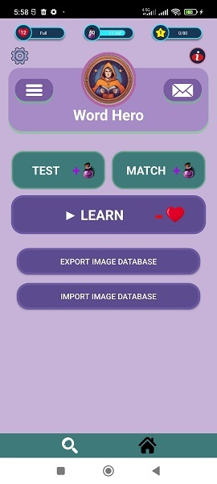

# Word Hero
Gamified application to learn all new vocabularies of the Interchange book series

## Abstract

This is a game android application written with android studio and java to help to improve your volcabulary in a smart way using images, quizes, and leitner method in which, every word repeats for you in a set of smart times to ensure you have learned it, and you never will forget it again.

## Related Repositories

- Using Interchange Book Series Vocabular Dataset [Interchange_Vocabulary_Dataset](../../../Interchange_Vocabulary_Dataset) Repository

- Using Image-Dictionary [Image-Dictionary](../../../Image-Dictionary) Repository

